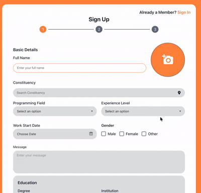

# 📝 მრავალეტაპიანი რეგისტრაციის ფორმა

**🇬🇪 ქართული** | [🇬🇧 English](./README.md)

თანამედროვე, სრულად რესპონსიული მრავალეტაპიანი რეგისტრაციის ფორმა, აგებული Next.js, TypeScript და React Hook Form-ით.


---

## ✨ ფუნქციები

- 🎨 **თანამედროვე UI/UX** - სუფთა და ინტუიციური დიზაინი
- 📱 **სრულად რესპონსიული** - მუშაობს ყველა მოწყობილობაზე
- 🔐 **ფორმის ვალიდაცია** - Yup schema validation
- 🎯 **მრავალეტაპიანი პროცესი** - 3-ეტაპიანი რეგისტრაცია
- 🌐 **Sign In/Sign Up** - სრული ავთენტიფიკაციის UI
- ♿ **ხელმისაწვდომი** - WCAG შესაბამისი კომპონენტები
- 🎭 **მრავალჯერადი გამოყენება** - მოდულარული და მოვლადი კოდი
- 🚀 **TypeScript** - ტიპ-უსაფრთხო დეველოპმენტი

---

## 🎬 დემო

<!-- დაამატეთ GIF აქ -->


---

## 📦 ინსტალაცია

### მოთხოვნები
- Node.js 18+ 
- npm ან yarn

### დაყენება

```bash
# რეპოზიტორიის კლონირება
git clone https://github.com/yourusername/webform.git

# პროექტის დირექტორიაში გადასვლა
cd webform

# დამოკიდებულებების დაყენება
npm install

# დეველოპმენტ სერვერის გაშვება
npm run dev
```

გახსენით [http://localhost:3000](http://localhost:3000) ბრაუზერში სანახავად.

---

## 🏗️ პროექტის სტრუქტურა

```
WebForm/
├── app/
│   ├── components/
│   │   ├── Button/           # მრავალჯერადი ღილაკის კომპონენტი
│   │   ├── Calendar/         # თარიღის არჩევის კომპონენტი
│   │   ├── Checkbox/         # ჩეკბოქსების ჯგუფის კომპონენტი
│   │   ├── EmailSection/     # ემაილი და პაროლის ეტაპი
│   │   ├── Form/             # მთავარი რეგისტრაციის ფორმა
│   │   ├── Input/            # ტექსტის ინფუთის კომპონენტი
│   │   ├── SelectInput/      # Dropdown სელექტის კომპონენტი
│   │   ├── SignIn/           # შესვლის გვერდი
│   │   └── SummarySection/   # საბოლოო შეჯამების ეტაპი
│   ├── styles/
│   │   └── _variables.scss   # SCSS ცვლადები
│   ├── globals.scss          # გლობალური სტილები
│   ├── layout.tsx            # Root layout
│   └── page.tsx              # მთავარი გვერდი
├── public/                   # სტატიკური ფაილები
├── docs/                     # დოკუმენტაცია და სქრინშოთები
└── README.md                 # ეს ფაილი
```

---

## 🎯 რეგისტრაციის პროცესი

### ეტაპი 1: ძირითადი ინფორმაცია
- სრული სახელი
- საარჩევნო ოლქი
- პროგრამირების მიმართულება (Dropdown)
- გამოცდილების დონე (Dropdown)
- სამუშაოს დაწყების თარიღი (კალენდარი)
- სქესი (რადიო ღილაკები)
- შეტყობინება (Textarea)
- განათლება (ხარისხი, ინსტიტუტი, დამთავრების თარიღი)

### ეტაპი 2: ანგარიშის შექმნა
- ელ-ფოსტა
- პაროლი
- პაროლის დადასტურება

### ეტაპი 3: შეჯამება და გადახედვა
- ყველა შეყვანილი ინფორმაციის გადახედვა
- გაგზავნა ან უკან დაბრუნება რედაქტირებისთვის

---

## 🧩 კომპონენტები

თითოეული კომპონენტი დამოუკიდებელია და შეიცავს:
- TypeScript ტიპებს
- SCSS მოდულებს
- ვალიდაციის სქემებს (სადაც საჭიროა)
- README დოკუმენტაციას

### ხელმისაწვდომი კომპონენტები:

| კომპონენტი | აღწერა | დოკუმენტაცია |
|-----------|--------|--------------|
| **Button** | ღილაკი ვარიანტებით | [README](./app/components/Button/README.md) |
| **Calendar** | თარიღის არჩევა ვალიდაციით | [README](./app/components/Calendar/README.md) |
| **Checkbox** | ჩეკბოქსების ჯგუფი | [README](./app/components/Checkbox/README.md) |
| **Input** | ტექსტის ინფუთი აიქონებით | [README](./app/components/Input/README.md) |
| **SelectInput** | Dropdown სელექტი | [README](./app/components/SelectInput/README.md) |
| **EmailSection** | ემაილი და პაროლის ფორმა | [README](./app/components/EmailSection/README.md) |
| **SignIn** | შესვლის გვერდი | [README](./app/components/SignIn/README.md) |
| **SummarySection** | საბოლოო შეჯამება | [README](./app/components/SummarySection/README.md) |

---

## 🛠️ გამოყენებული ტექნოლოგიები

- **ფრეიმვორქი:** Next.js 15.5.0
- **ენა:** TypeScript 5
- **UI ბიბლიოთეკა:** React 19
- **ფორმის მართვა:** React Hook Form
- **ვალიდაცია:** Yup
- **სტილიზაცია:** SCSS Modules
- **აიქონები:** React Icons
- **კალენდარი:** React Calendar

---

## 📚 დოკუმენტაცია

- [კომპონენტების დოკუმენტაცია](./docs/COMPONENTS.md)
- [სტილიზაციის გზამკვლევი](./docs/STYLING.md)
- [ფორმის ვალიდაცია](./docs/VALIDATION.md)
- [წვლილის შეტანის წესები](./CONTRIBUTING.md)

---

## 🤝 წვლილის შეტანა

წვლილი მისასალმებელია! გთხოვთ გამოგვიგზავნოთ Pull Request.

1. გააკეთეთ პროექტის Fork
2. შექმენით თქვენი feature branch (`git checkout -b feature/AmazingFeature`)
3. Commit გაუკეთეთ ცვლილებებს (`git commit -m 'დაემატა ახალი ფუნქცია'`)
4. Push გაუკეთეთ branch-ს (`git push origin feature/AmazingFeature`)
5. გახსენით Pull Request

---

## 📄 ლიცენზია

ეს პროექტი ლიცენზირებულია MIT ლიცენზიით - დეტალებისთვის იხილეთ [LICENSE](LICENSE) ფაილი.

---

## 👤 ავტორი

**თამარ ხუსკივაძე**

- GitHub: [@tamarkhuskivadze](https://github.com/tamarkhuskivadze)

---

## 🙏 მადლობა

- Next.js გუნდს შესანიშნავი ფრეიმვორქისთვის
- React Hook Form-ს ფორმების მართვისთვის
- ყველა open-source კონტრიბუტორს

---

## 📞 მხარდაჭერა

თუ გაქვთ კითხვები ან გჭირდებათ დახმარება, გთხოვთ გახსნათ issue GitHub-ზე.

---

შექმნილია ❤️-ით თამარ ხუსკივაძის მიერ
